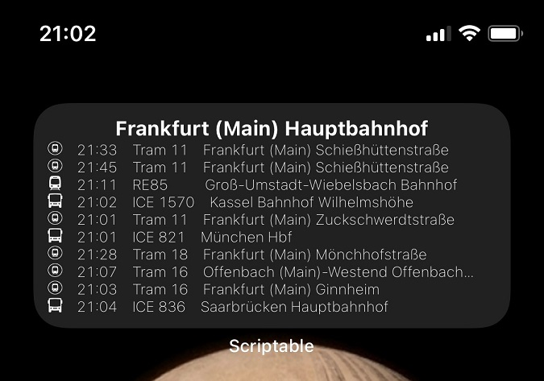

- [Hessen Way](#hessen-way)
- [Introduction](#introduction)
- [How to use](#how-to-use)
  - [Setup](#setup)
  - [Get the location id](#get-the-location-id)

# Hessen Way
A widget that helps you knowing when the next public transport is passing by.

# Introduction
This widget will create a time table with the next public transports that will stop at a specified station. Public transport means bus, train, subway, etc..

It was built to work in Frankfurt am Main (Germany) but it will support any area covered by [RMV](https://www.rmv.de/c/en/homepage).

# How to use
## Setup
Add parameter

## Get the location id

