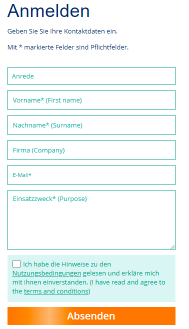
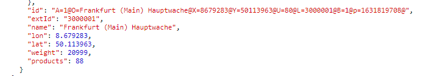

- [Hessen Way](#hessen-way)
- [Introduction](#introduction)
- [How to use](#how-to-use)
  - [Configure the API key](#configure-the-api-key)
    - [1. Request an API key](#1-request-an-api-key)
    - [2. Enter the key in the configuration](#2-enter-the-key-in-the-configuration)
  - [Configure the departure location](#configure-the-departure-location)
    - [How to find the id to be put in the parameter](#how-to-find-the-id-to-be-put-in-the-parameter)
- [Recomended setup](#recomended-setup)
  - [Multiple destinations](#multiple-destinations)
  - [Force update](#force-update)
- [Future developments](#future-developments)

# Hessen Way
A [Scriptable App](https://scriptable.app/) widget that helps you knowing when the next public transport is passing by.

It allows you to define one departure station and keeps you updated on the next transports leaving that station. Be it a train, a bus, or other, you always know when to leave.

The intention is to use this script with specific stops that you use frequently. Be it near home, near work, or any other place where you go often.

It supports multiple widget sizes so you can perfectly adapt it to your screen and your personal usage of your phone.

# Introduction
This widget will create a time table with the next public transports that will depart a a specified station. Public transport means bus, train, subway, etc..

It was built to work in Frankfurt am Main (Germany) but it will support any area covered by [RMV](https://www.rmv.de/c/en/homepage).

# How to use
## Configure the API key
In order to retrieve the departure information the script uses the official [RMV](https://www.rmv.de/c/en/homepage) data. This access needs to be allowed by using an specific key that needs to be configured by you.

### 1. Request an API key
  To obtain an API key go to [RMV's Open Data page](https://opendata.rmv.de/site/anmeldeseite.html) and register. The page is in german but it's easy to follow and has english instructions between brakets.

  
 
  After a few hours you will receive an email with the key assigned to you.

### 2. Enter the key in the configuration
  Use your email application to open the email sent to you by RMV. Select the API key and copy to the clipboard. Open the [Scriptable App](https://scriptable.app/) application and run the HessenWay script. A menu will be shown.
  
  Select the first option: "Enter API key".
  Paste the key in the text box and click "OK". 

## Configure the departure location
In order to obtain the time table the widget needs to have the departure station of your preference. This is done in the widget configuration.
Enter the widget's edit menu by long pressing the widget in your phone screen. Here you'll find the field "Parameter". Enter the id of your prefered location.
By doing the location setup in this way it is possible to have multiple instances of the widget, each one showing the information of a different departure station.

### How to find the id to be put in the parameter
The id to use need to be retrieved from RMV. This task is done by using the following link: https://www.rmv.de/hapi/location.name?format=json&accessId=<API_KEY>&input=\<LOCATION>

Replace the <API_KEY> with the key you received on [1. Request an API key](#1-request-an-api-key) and <LOCATION> with the place you are looking for.
Place the result in your browser and you'll receive a list of stops that match your search.

---
**NOTE:**
The visualization of the result in the browser is not very friendly. You can solve this by using the developer tools of your browser or other tools like [JSONLint](https://jsonlint.com/) or [jayson](https://jayson.app/)

---

Once you have the result you can look for an object with the name matching the stop you want. Next to it you'll find another parameter called "extId". This is the value that is needed to put in the widget's configuration.

Here you can see an example when looking for Frankfurt's Hauptwache station:

The name is "Frankfurt (Main) Hauptwache" and the id is "3000001". This number is the right one to be used.

# Recomended setup
## Multiple destinations
## Force update
Due to the way how iPhone widgets work it's not possible to know when 

# Future developments
Depending on public usage and requests, and my personal availability, this widget will continue to improve. Some of the ideas that are in the pipeline:
- [ ] Add an entry in the widget's menu to search for locations and retrieve the location id to be used in the widget configuration
- [ ] Automatic update the widget when there are new versions
- [ ] Improve the visualization
  - [ ] Title display on the small widget
  - [ ] Table alignment on the medium and larget widgets
- [ ] Incorporate other travel companies/areas

If this widget is helpful for you and you'd like to see one of these implemented, or if you have any other improvement idea, just reach out to me. You can contact me in multiple ways but if everything else fails you can send me an [email](mailto:flavio@gedons.com). 